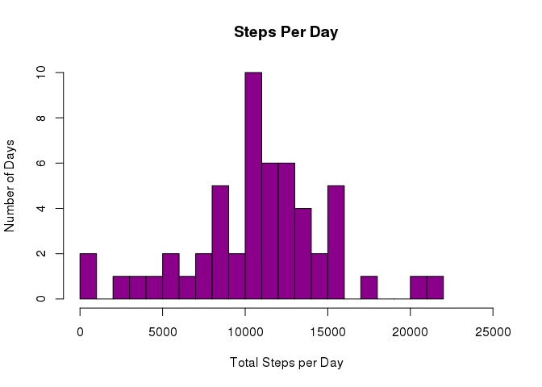
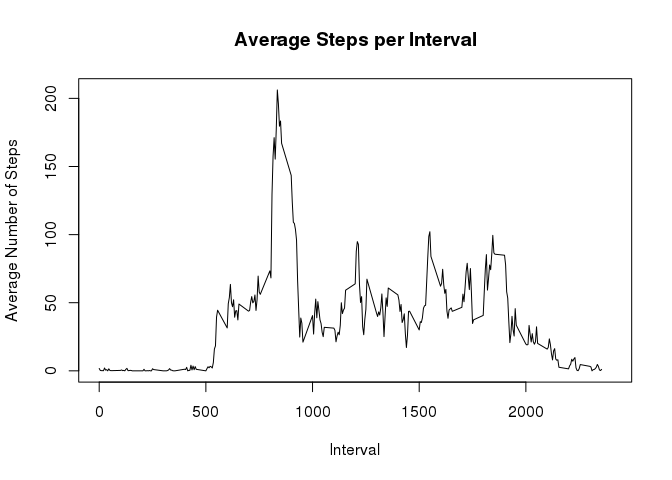
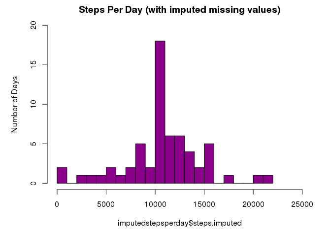
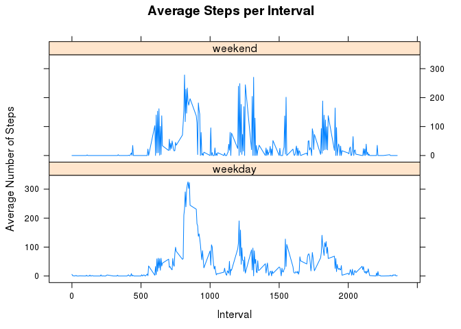

This is an analysis of data from a personal activity monitoring device. This device collects data at 5 minute intervals through out the day. The data consists of two months of data from an anonymous individual collected during the months of October and November, 2012 and include the number of steps taken in 5 minute intervals each day.


## What is mean total number of steps taken per day?


```r
stepsperday <- aggregate(steps~date, activity, sum)
```


<!-- -->
  
  Calculation and report of the mean and median of the total number of steps taken per day:  
  

```r
mean(stepsperday$steps)
```

```
## [1] 10766.19
```

```r
median(stepsperday$steps)
```

```
## [1] 10765
```

## What is the average daily activity pattern?


```r
avgstepsperinterval <- aggregate(steps~interval,activity,mean)
plot(x = avgstepsperinterval$interval, xlim=c(0,2400), y = avgstepsperinterval$steps, type = "l", main = "Average Steps per Interval", xlab = "Interval", ylab = "Average Number of Steps")
```

<!-- -->
  
  Which 5-minute interval, on average across all the days in the dataset, contains the maximum number of steps?  
  

```r
avgstepsperinterval[which.max(avgstepsperinterval$steps),]
```

```
##     interval    steps
## 104      835 206.1698
```
  
## Imputing missing values  

  Note that there are a number of days/intervals where there are missing values (coded as \color{red}{\verb|NA|}NA). The presence of missing days may introduce bias into some calculations or summaries of the data.  
    
The total of rows in the data set with missing values is:


```r
sum(is.na(activity$steps))
```

```
## [1] 2304
```
  To impute missing values, I repaced the missing value with the average number of steps for that interval.  
  

```r
library(dplyr)
```

```
## 
## Attaching package: 'dplyr'
```

```
## The following objects are masked from 'package:stats':
## 
##     filter, lag
```

```
## The following objects are masked from 'package:base':
## 
##     intersect, setdiff, setequal, union
```

```r
activityimputed <- activity %>% left_join(avgstepsperinterval, by="interval", all.x=TRUE, suffix = c(".actual", ".avg"))
activityimputed <- transform(activityimputed, steps.imputed = ifelse(is.na(round(as.numeric(steps.actual))), round(as.numeric(steps.avg)), round(as.numeric(steps.actual))))
imputedstepsperday <- aggregate(steps.imputed~date, activityimputed, sum)
par(mar=c(5,5,2,2))
hist(imputedstepsperday$steps.imputed, main="Steps Per Day (with imputed missing values)", ylab = "Number of Days", col = "darkmagenta", breaks=20, xlim=c(0,25000), ylim=c(0,20))
```

<!-- -->
  
The mean and median total number of steps taken per day are:

```r
mean(imputedstepsperday$steps)
```

```
## [1] 10765.64
```

```r
median(imputedstepsperday$steps)
```

```
## [1] 10762
```

  There is a difference between these estimates and those from the first part of the assignment  
  The impact of imputing missing data as the average number of steps for that interval is that the number of days in the average number of steps interval increased.

## Are there differences in activity patterns between weekdays and weekends?

  First set up data to determine weekend vs weekday and aggregte

```r
activity$weekday <- ifelse(weekdays(as.Date(activity$date)) == c("Saturday", "Sunday"), "weekend", "weekday")
wavgstepsperinterval <- aggregate(steps~interval + weekday, activity, mean)
wavgstepsperinterval$weekday <- factor(wavgstepsperinterval$weekday)  # , labels = c("weekday", "weekend"))
```
  

```r
library(lattice) 
xyplot(steps ~ interval | factor(weekday), data=wavgstepsperinterval, type="l", main = "Average Steps per Interval", xlab = "Interval", ylab = "Average Number of Steps", layout = c(1, 2))
```

<!-- -->
    
  

